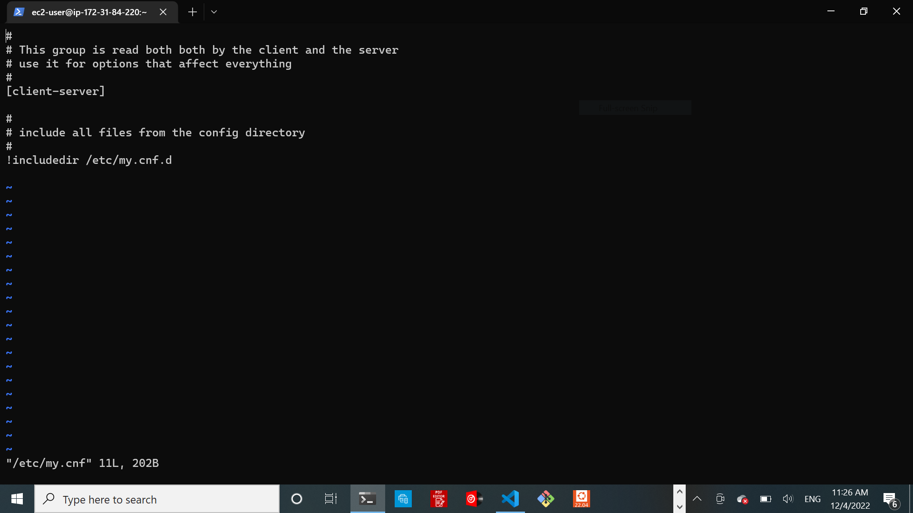

## **PROJECT 6: Web Solution With WordPress**

### **Step 1 — Prepare a Web Server**

Created 3 EBS Volumes and attached to Web server EC2 instance 


Inspect installed divices

`lsblk`


Check mounts and free space on your server:

 `df -h`

 


  Create a single partition on each of the 3 disks

  `sudo gdisk /dev/xvdf`

  

  


  View the newly configured partition on each of the 3 disks.

  `lsblk`

  

**Install `lvm2` package**

`sudo yum install lvm2`

Check for available partitions.

`sudo lvmdiskscan`


**Use pvcreate utility to Mark each of 3 disks as physical volumes (PVs) to be used by LVM**

`sudo pvcreate /dev/xvdf1`

`sudo pvcreate /dev/xvdg1`

`sudo pvcreate /dev/xvdh1`


**Verify that your Physical volume has been created successfully:**

`sudo pvs`


**Use `vgcreate` utility to add all 3 PVs to a volume group (VG). Name the VG webdata-vg**

`sudo vgcreate webdata-vg /dev/xvdh1 /dev/xvdg1 /dev/xvdf1`


Verify that your VG has been created successfully:

`sudo vgs`


Use `lvcreate` utility to create 2 logical volumes. `apps-lv` (Use half of the PV size), and `logs-lv` Use the remaining space of the PV size. NOTE: apps-lv will be used to store data for the Website while, logs-lv will be used to store data for logs.

`sudo lvcreate -n apps-lv -L 14G webdata-vg`

`sudo lvcreate -n logs-lv -L 14G webdata-vg`

Verify that your Logical Volume has been created successfully:

`sudo lvs`


**Verify the entire setup**

`sudo vgdisplay -v`  #view complete setup - VG, PV, and LV

`sudo lsblk `


**Use `mkfs.ext4` to format the logical volumes with `ext4` filesystem**

 
 `sudo mkfs -t ext4 /dev/webdata-vg/apps-lv`

`sudo mkfs -t ext4 /dev/webdata-vg/logs-lv`


### **Mounting the 2 LVs created:**

Create `/var/www/html` directory to store website files

`sudo mkdir -p /var/www/html`

Create `/home/recovery/logs` to store backup of log data

`sudo mkdir -p /home/recovery/logs`


Mount `/var/www/html` on `apps-lv` logical volume


`sudo mount /dev/webdata-vg/apps-lv /var/www/html/`


**Use rsync utility to backup all the files in the log directory /var/log into /home/recovery/logs (This is required before mounting the file system)**

`sudo rsync -av /var/log/. /home/recovery/logs/`

** Mount `/var/log` on `logs-lv` logical volume. (Note that all the existing data on `/var/log` `will be deleted`. That is why step 15 above is very
important)

`sudo mount /dev/webdata-vg/logs-lv /var/log`


**Restore log files back into `/var/log` directory**

`sudo rsync -av /home/recovery/logs/. /var/log`

**Update `/etc/fstab` file so that the mount configuration will persist after restart of the server.**

The `UUID of the device` will be used to update the `/etc/fstab`file;

`sudo blkid`


`sudo vi /etc/fstab`

`Update /etc/fstab` in this format using your mounted LVs UUID and rememeber to remove the leading and ending quotes.


**Test the configuration and reload the daemon**

`sudo mount -a`

`sudo systemctl daemon-reload`

**Verify your setup** 

`df -h`


### **Step 2 — Prepare the Database Server**

Launch a second RedHat EC2 instance that will have a role – ‘DB Server’


Create db-lv and mount it to /db directory instead of /var/www/html/.
After creating the db-lv volume check:

Verify the entire setup

`sudo vgdisplay -v`  #view complete setup - VG, PV, and LV

`sudo lsblk`


**Use mkfs.ext4 to format the logical volumes with ext4 filesystem**

`sudo mkfs -t ext4 /dev/dbdata-vg/db-lv`


Create /var/www/html directory to store database data.

`sudo mkdir -p /var/www/html`

Mount `/var/www/html` on `db-lv` logical volume

`sudo mount /dev/dbdata-vg/db-lv /var/www/html`

**Update `/etc/fstab` file so that the mount configuration will persist after restart of the server.**

The `UUID` of the device will be used to update the /etc/fstab file;

`sudo blkid`


`sudo vi /etc/fstab`


**Test the configuration and reload the daemon**

`sudo mount -a`

 `sudo systemctl daemon-reload`

**Verify your setup by running `df -h`, output must look like this:**

`sudo df -h`


### **Step 3 — Install WordPress on your Web Server EC2**

Update the repository

`sudo yum -y update`

**Install wget, Apache and it’s dependencies**

`sudo yum -y install wget httpd php php-mysqlnd php-fpm php-json`


***Start Apache**

`sudo systemctl enable httpd`

`sudo systemctl start httpd`


**To install PHP and it’s depemdencies**

- First, install the EPEL repository.

`sudo yum install https://dl.fedoraproject.org/pub/epel/epel-release-latest-8.noarch.rpm`


- Next, install `yum utils` and enable remi-repository 

`sudo yum install yum-utils http://rpms.remirepo.net/enterprise/remi-release-8.rpm`


- After the successful installation of `yum-utils` and `Remi-packages`, `search for the PHP modules` which are available for download by running the command.

`sudo yum module list php`

- To install the newer release, PHP, `reset the PHP modules`.

`sudo yum module reset php`


- Having reset the PHP modules, enable the PHP module by running.

`sudo yum module enable php`


- Finally, install `PHP`, `PHP-FPM` (FastCGI Process Manager) and associated `PHP modules` using the command.

`sudo yum install php php-opcache php-gd php-curl php-mysqlnd`


- To verify the version installed, run.
 
 `php -v`


- Start and enable PHP-FPM on boot-up.

`sudo systemctl start php-fpm`

`sudo systemctl enable php-fpm `


- To instruct `SELinux` to allow Apache to execute the `PHP` code via `PHP-FPM run`.

`sudo setsebool -P httpd_execmem 1`

- Finally, `restart Apache` web server for PHP to work with Apache web server.

$` sudo systemctl restart httpd`

`sudo systemctl status httpd`


### **Download `wordpress` and copy `wordpress` to `var/www/html`**


  `mkdir wordpress`

  `cd   wordpress`

  `sudo wget http://wordpress.org/latest.tar.gz`

  Unzip downloaded file:

  `sudo tar xzvf latest.tar.gz`

  `sudo rm -rf latest.tar.gz`

  `sudo cp wordpress/wp-config-sample.php wordpress/wp-config.php`


  `cp -R wordpress /var/www/html/`

  

### **Configure `SELinux` Policies**

```py
sudo chown -R apache:apache /var/www/html/wordpress`

sudo chcon -t httpd_sys_rw_content_t /var/www/html/wordpress -R

sudo setsebool -P httpd_can_network_connect=1
```

## **Step 4 — Install MySQL on your DB Server EC2**

`sudo yum update`

`sudo yum install mysql-server`

Verify that the service is up and running by using sudo systemctl status mysqld, if it is not running, restart the service and enable it so it will be running even after reboot:

`sudo systemctl restart mysqld`

`sudo systemctl enable mysqld`


### **Step 5 — Configure DB to work with WordPress**


```py
sudo mysql

CREATE DATABASE wordpress;

CREATE USER `myuser`@`<Web-Server-Private-IP-Address>` IDENTIFIED BY 'mypass';

GRANT ALL ON wordpress.* TO 'myuser'@'<Web-Server-Private-IP-Address>';

FLUSH PRIVILEGES;

SHOW DATABASES;

exit
```


### **Step 6 — Configure WordPress to connect to remote database.**

Hint: Do not forget to open MySQL port 3306 on DB Server EC2. For extra security, you shall allow access to the DB server ONLY from your Web Server’s IP address, so in the Inbound Rule configuration specify source as /32


### **Install MySQL client and test that you can connect from your Web Server to your DB server by using mysql-client**

`sudo yum install mysql-server`


**Set the bind address ond DBserver**


sudo vi /etc/my.cnf



Udate the `my.cnf` file to:


This alow any Ip to access the DB server.

To allow only the web server access to the db server, replace the `bind.address: 0.0.0.0` with the `web server private IP`

`sudo systemctl restart mysqld`


**Access the database localy from the webserver(client)**

`sudo mysql -u admin -p -h <DB-Server-Private-IP-address>`


**Change permissions and configuration on the `WEB server` so `Apache` could use `WordPress`:**


```py
sudo chown -R apache:apache /var/www/html/wordpress
sudo chcon -t httpd_sys_rw_content_t /var/www/html/wordpress -R
sudo setsebool -P httpd_can_network_connect=1
```
**Update wordpress php config file**

`sudo cd /var/www/html/wordpress`

`sudo vi wp-config.php`


Edit:
database name
database user
database user password
database hoste ip (db server private ip)

Restart php

`sudo systemctl restert httpd`

**Desable the `default apache page`**:

`sudo mv /etc/httpd/conf.d/welcome.conf /etc/httpd/conf.d/welcome.conf_backup`

Enable `TCP port 80` in Inbound Rules configuration for your Web Server EC2 (enable from everywhere 0.0.0.0/0 or from your workstation’s IP)


**Access from the browser the link to WordPress `http://<Web-Server-Public-IP-Address>/wordpress/`**


